# Chapter 1 - Java Primer  
Building data structures and algorithms requires that we communicate detailed instructions to a computer. An excellent way to perform such communication is using a high-level computer language, such as Java. In this chapter, we provide an overview of the Java programming language, and we continue this discussion in the next chapter, focusing on object-oriented design principles. We assume that readers are somewhat familiar with an existing high-level language, although not necessarily Java.  

## The Java Compiler  
Java is a compiled language.  
Programs are compiled into byte-code executable files, which are executed through the Java Virtual Machine (JVM).  
- The JVM reads each instruction and executes that instruction.  

A programmer defines a Java program in advance and saves that program in a text file known as source code.  
For Java, source code is conventionally stored in a file named with the **.java** suffix (e.g., **demo.java**) and the byte-code file is stored in a file named with a **.class** suffix, which is produced by the Java compiler.  

## Components of a Java Program  
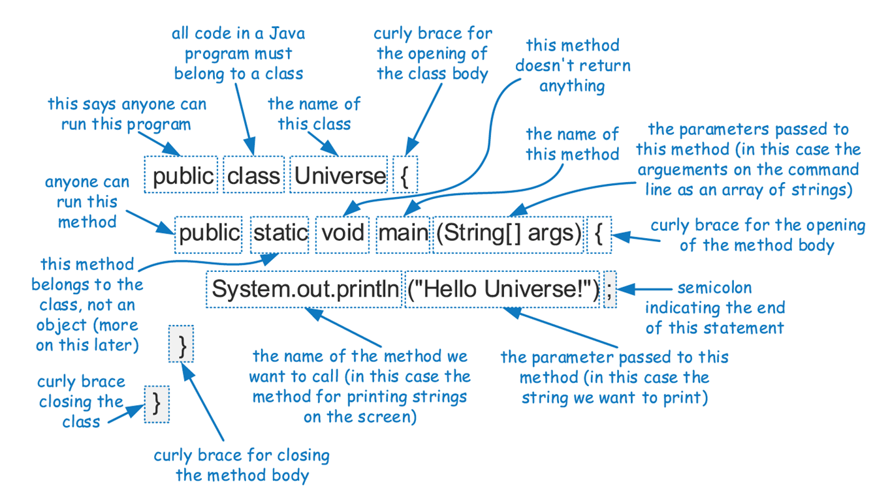  
You can run this program by [clicking here](EX01_01/EX01_01.java) or navigating to the EX01_01 folder.  
  
In Java, executable statements are placed in functions, known as **methods**, that belong to class definitions.  
The static method **main** is the first method to be executed when running a Java program.  
Any set of statements between the braces **{** and **}** define a program block.  
## Identifiers  
The name of a class, method or variable in Java is called an **identifier**, which can be any string of characters as long as it begins with a letter and consists of letters.  
  
You cannot use **Reserved Words** as identifiers.  
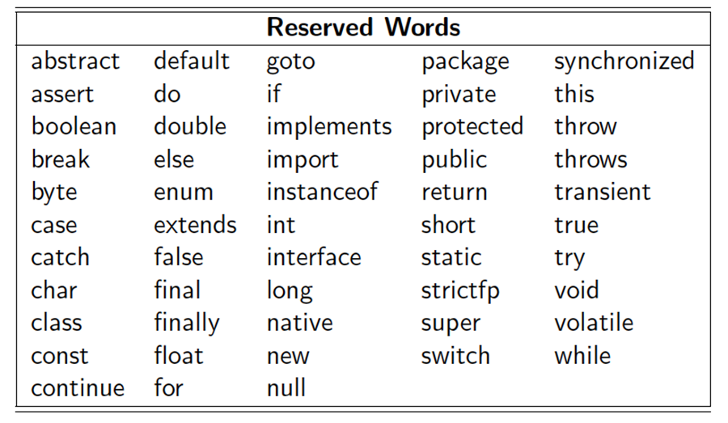  
## Comments  
In addition to executable statements and declarations, Java allows a programmer to embed comments, which are annotations provided for human readers that are not processed by the Java compiler.  
Java allows two kinds of comments:  Inline comments and block comments.  
You can run a program with comments by [clicking here](EX01_02/EX01_02.java) or navigating to the EX01_02 folder.  
*Note:*  The program doesn't do anything because it ignores all of the comments!  

## Base Types  
Java has several base types (also called **primitive types**), which are basic ways of storing data.  
An identifier variable can be declared to hold any base type and it can later be reassigned to hold another value of the same type.  

This is a list of the base types in Java:  
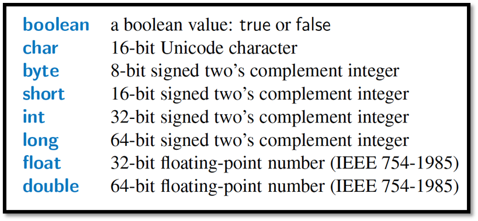  

A nice feature of Java is that when base-type variables are declared as instance variables of a class (see next section), Java ensures initial default values if not explicitly initialized.  

In particular, all numeric types are initialized to zero, a boolean is initialized to false, and a character is initialized to the null character by default.  

You can run a program that shows how to declare and initialize base types by [clicking here](EX01_03/EX01_03.java) or navigating to the EX01_03 folder.  
*Note:*  The program doesn't output anything because the variables are only declared and initialized, but not used for anything else!  

## Classes and Objects  
Every **object** is an instance of a **class**, which serves as the type of the object and as a blueprint, defining the data which the object stores and the methods for accessing and modifying that data.  

The critical members of a class in Java are the following:
- **Instance variables**, which are also called **fields**, represent the data associated with an object of a class.  Instance variables must have a type, which can either be a base type (such as int, float or double) or any class type.  
- **Methods** in Java are blocks of code that can be called to perform actions.  Methods can accept parameters as arguments, and their behavior may depend on the object upon which they are invoked and the values of any parameters that are passed.  A method that returns information to the caller without changing any instance variables is known as an **accessor** method, while an **update** or **mutator** method is one that may change one or more instance variables when called.  

This is an example of a class:  
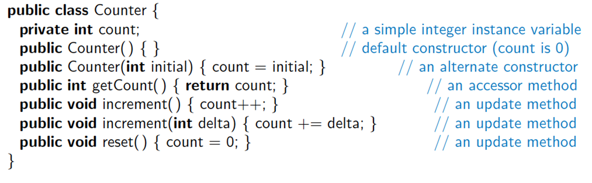  

You can [click here](EX01_04/Counter.java) to see the code for this class or navigate to Counter.java in the EX01_04 folder.  

This class includes one instance variable, named *count*, which will have a default value of zero, unless we initialize it.  
The class includes two special methods known as constructors, one accessor method, and three update methods.  

## Creating and Using Objects
Classes are known as **reference types** in Java, and a variable of that type is known as a **reference variable**.  
A reference variable is capable of storing the location (i.e., memory address) of an object from the declared class.  
- So we might assign it to reference an existing instance or a newly constructed instance.  
- A reference variable can also store a special value, **null**, that represents the lack of an object.  

In Java, a new object is created by using the **new** operator followed by a call to a constructor for the desired class.  
A **constructor** is a method that always shares the same name as its class.  The new operator returns a reference to the newly created instance;  the returned reference is typically assigned to a variable for future use.  

In this example, a new Counter is constructed at line 4, with its reference assigned to the variable c.  That relies on a form of the constructor, Counter (), that takes no arguments between the parentheses.  
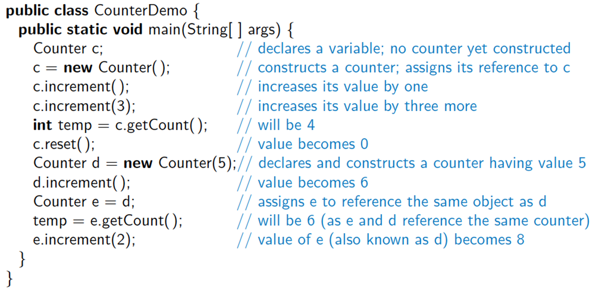  

You can [click here](EX01_04/CounterDemo.java) to see the code for this class or navigate to CounterDemo.java in the EX01_04 folder.  

## The Dot Operator  
One of the many primary uses of an object reference variable is to access the members of the class for this object, an instance of its class.  
This access is performed with the dot (".") operator.  
We call a method associated with an object by using the reference variable name, following that by the dot operator, and then the method name and its parameters.  

## Wrapper Types  
There are many data structures and algorithms in Java's libraries that are specifically designed so that they only work with object types (not primitives).  
To get around this obstacle, Java defines a **wrapper** class for each base type.
- Java provides additional support for implicitly converting between base types and their wrapper types through a process known as automatic **boxing** and **unboxing**.

This is a table of Example Wrapper Types  
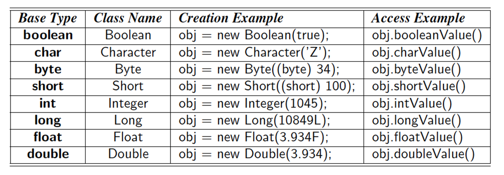  

Java provides additional support for implicitly converting between base types and their wrapper types through a process known as automatic boxing and unboxing.  

In any context for which an Integer is expected (for example, as a parameter), an int value k can be expressed, in which case Java automatically boxes the int, with an implicit call to new Integer(k). In reverse, in any context for which an int is expected, an Integer value v can be given in which case Java automatically unboxes it with an implicit call to v.intValue( ). Similar conversions are made with the other base-type wrappers.  

This is an example with a demonstration of many such features:  
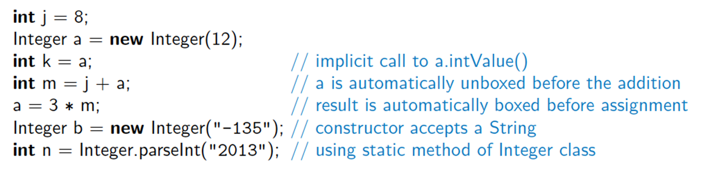  

**Note:**  Some of the code in your book has been depreciated due to updates to Java.  When that happens, I will give you the original code AND an updated version.  
You can [click here](EX01_05/EX01_05.java) to see  **original** code for this class or navigate to EX01_05.java in the EX01_05 folder.  
Then, you can [click here](EX01_05/EX01_05updated.java) to see  **updated** code for this class or navigate to EX01_05updated.java in the EX01_05 folder.  

## Signatures  
If there are several methods with this same name defined for a class, then the Java runtime system uses the one that matches the actual number of parameters set as arguments, as well as their respective types.  
A method's name combined with the number and types of its parameters is called a method's **signature**, for it takes all of these parts to determine the actual method to perform for a certain method call.  
A reference variable *v* can be viewed as a "pointer" variable to some object *o*.  

## Defining Classes  
A **class definition** is a block of code, delimited by braces **{** and **}**, within which is included declarations of instance variables and methods that are the members of the class.  
Immediately before the definition of a class, instance variable or method in Java, keywords known as modifiers can be placed to convey additional stipulations about that definition.  

## Access Control Modifiers  
- The **public** class modifier designates that all classes may access the defined aspect.  
- The **protected** class modifier designates that access to the defined aspect is only granted to classes that are designated as subclasses of the given class through inheritance or in the same package.  
- The **private** class modifier designates that access to a defined member of a class be granted only to code within that class.  
- When a variable or method of a class is declared as **static**, it is associated with the class as a whole, rather than with each individual instance of that class.  

## Parameters  
A method's parameters are defined in a comma-separated list enclosed in parethesis after the name of the method.
- A parameter consists of two parts, the parameter type and the parameter name.  
- If a method has no parameters, then only an empty pair of parenthesis is used.

All parameters in Java are **passed by value**, that is, any time we pass a parameter to a method, a copy of that parameter is made for use within the method body.  
- So if we pass an int variable to a method, then that variable's integer value is copied.  
- The method can change the copy but not the original.  
- If we pass an obnect reference as a parameter to a method, then the reference is copied as well.  

## The Keyword this  
Within the body of a method in Java, the keyword **this** is automatically defined as a reference to th einstance upon which the method was invoked.  There are three common uses:  
- To store the reference in a variable, or send it as a parameter to another method that expects an instance of that type as an argument.  
- To differentiate between an instance variable and a local variable with the same name.  
- To allow one constructor body to invoke another constructor body  
  
## Expressions and Operators  
Existing values can be combined into expressions using special symbols and keywords known as operators.  

The semantics of an operator depends on the type of its operands.  

For example, when a and b are numbers, the syntax a + b indicates addition, while if a and b are strings, the operator + indicates concatenation.  
### Arithmetic Operators  
Java supports the following arithmetic operators:  
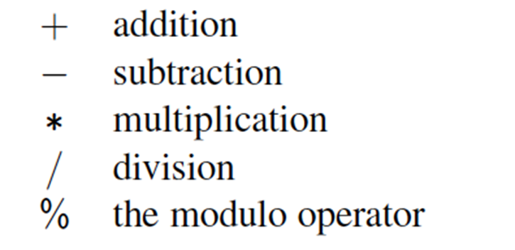  
If both operands have type int, then the result is an int;  if one or both operands have the type float, then the result is a float.  
Integer division has its result truncated to the nearest whole number.    
### Increment and Decrement Operators  
Java provides the plus-one increment (++) and decrement (--) operators.  
- If such an operator is used in front of a variable reference, then 1 is added to (or subtracted from) the variable and its value is read into the expression.  
- If it is used after a variable reference, then the value is first read and then the variable is incremented or decremented by 1.  

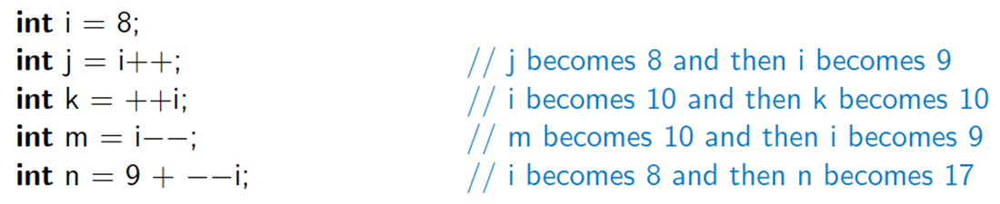  

You can [click here](EX01_06/EX01_06.java) to see code demonstrating these operators or navigate to EX01_06.java in the EX01_06 folder.  

### Logical Operators  
Java supports the following operators for numerical values, wich result in Boolean values:  
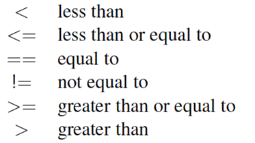  

Boolean values also have the following operators:  
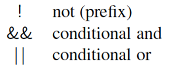  

The **and** and **or** operators **short circuit**, in that they do not evaluate the second operand if the result can be determined based on the first operand.  

### Bitwise Operators  
Java provides the following bitwise operators for integers and booleans:  
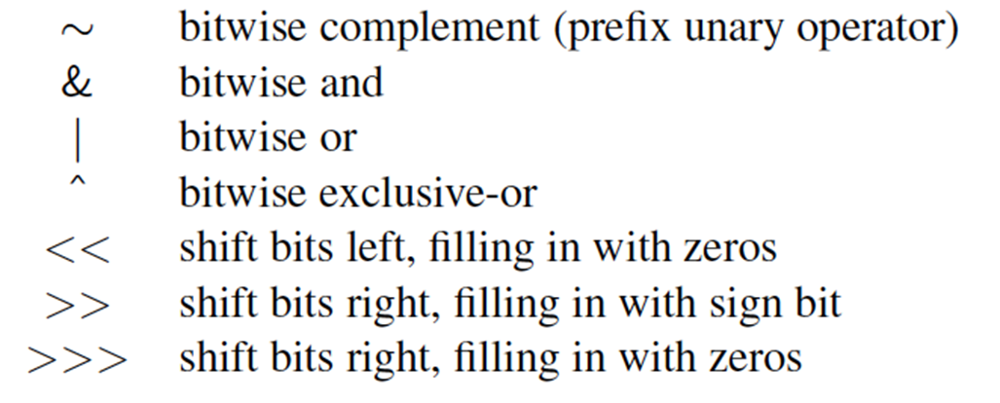  

### Operator Precedence  
Operators in Java are given preferences, or precedence, that determine the order in which operations are performed when the absence of parentheses brings up evaluation ambiguities. For example, we need a way of deciding if the expression, “5+2*3,” has value 21 or 11 (Java says it is 11). We show the precedence of the operators in Java (which, incidentally, is the same as in C and C++)  

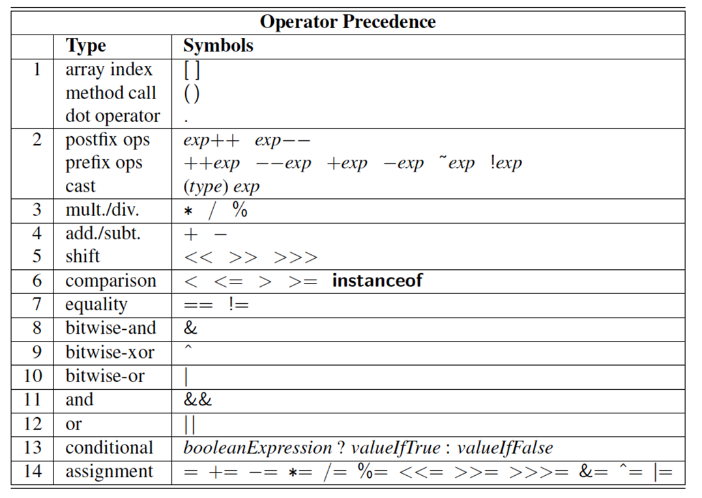  

## Casting  
Casting is an operation that allows us to change the type of a value.  

We can take a value of one type and cast it into an equivalent value of another type.  

There are two types of casting: **Explicit** and **Implicit**

### Explicit Casting
Java supports an explicit casting syntax with the following form: (type) exp  
Where "type" is the type we would like the expression "exp" to have.  
This syntax may only be used to cast from one primitive to another primitive type, or from one reference type to another reference type.

For example:  
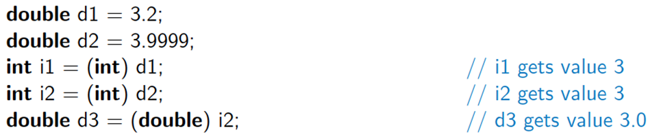  

### Implicit Casting  
There are cases where Java will perform an implicit cast based on the context of an expression.  
You can perform a **widening cast** between primitive types (such as from an int to a double), without explicit use of the casting operator.  
However, if attempting to do an implicit **narrowing cast**, a compiler error results as shown below:  

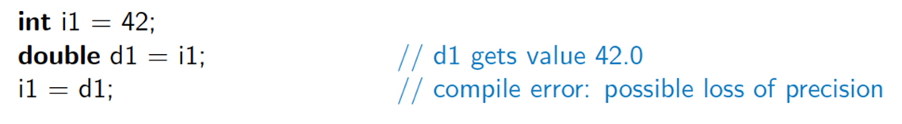  
